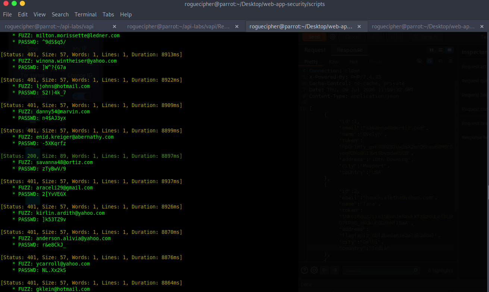
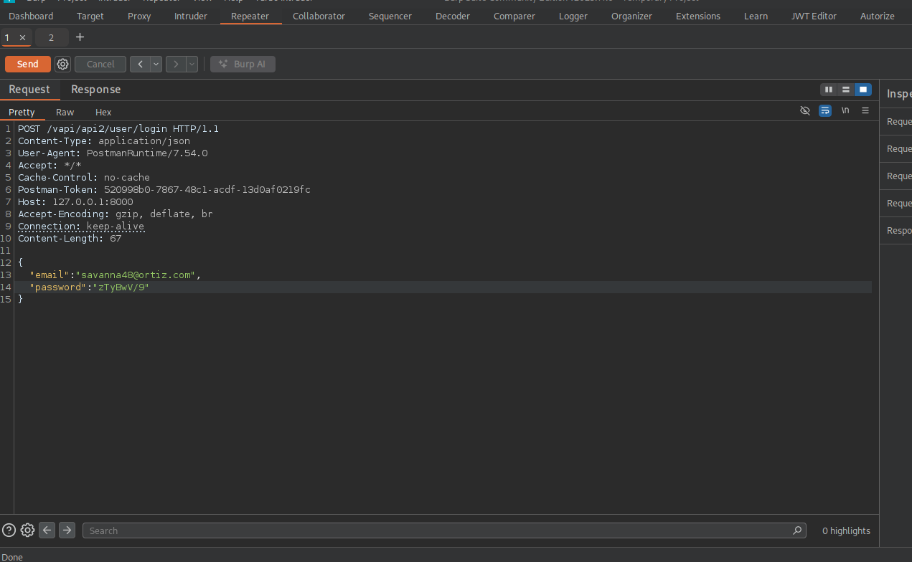
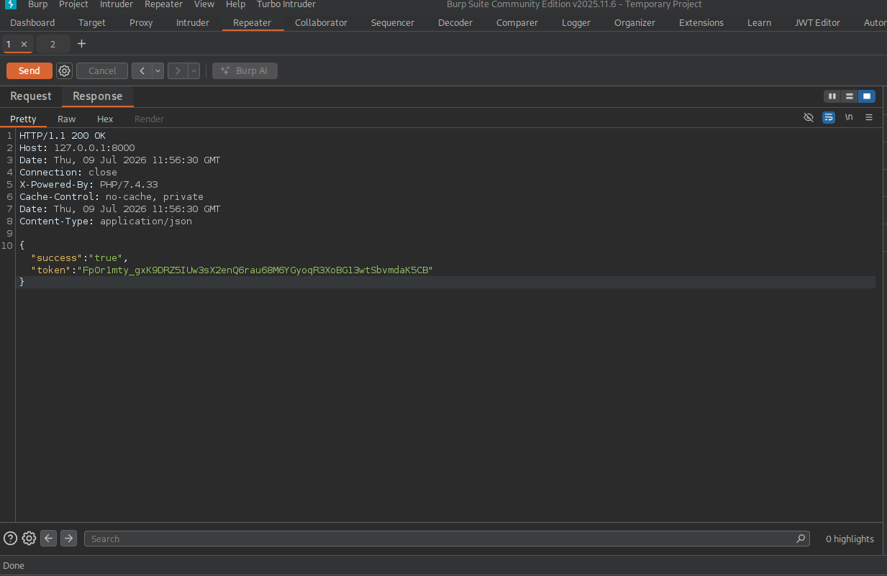
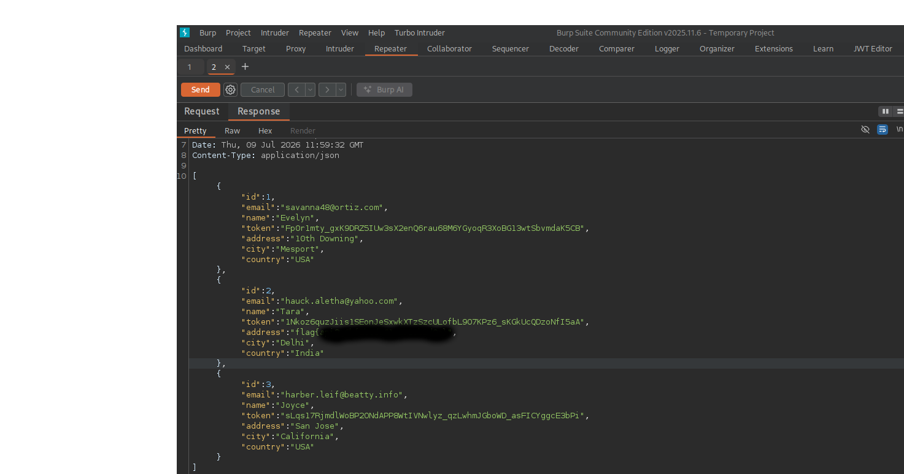

### Title
`Broken Authentication & Excessive Data Exposure in Vapi — Credential Bruteforce Leads to Full User Table and Token Disclosure.`

### Metadata
- **Target:** Vapi
- **Environment:** Local lab
- **Date tested:** 09 July, 2026 
- **Tester:** Babs-pentest
- **Vuln class(es):** API2:2023 Broken Authentication & API3:2023 Broken Object Property Level Authorization
- **CWE(s):**  CWE-307, CWE-213
- **Severity (Excessive data exposure):** Medium(6.5) — CVSS vector string CVSS:3.1/AV:N/AC:L/PR:L/UI:N/S:U/C:H/I:N/A:N
- **Severity (Broken Authentication):** High(7.5) — CVSS vector string: CVSS:3.1/AV:N/AC:L/PR:N/UI:N/S:U/C:H/I:N/A:N

### Summary
The /api/vapi/api2/user/login endpoint did not implement any form of lockout policy and the /vapi/api2/user/details endpoint is returning the whole content of the user's table leading to information disclosure that can further lead to horizontal privilege escalation. 


### Prerequisites
- Tools used: Burp CE, ffuf, Postman, Python
- Access required to start: None
- Wordlists/config: creds.csv present in the Resources folder

### Methodology (chronological, reproducible)
Number every step. Each step = one action + one observation. If a step failed before you fixed it, include the failure — it shows real methodology, not a cleaned-up fairy tale.

1. **Created the vapi_api2_(users/passwords) from the creds.csv** — 
Screenshot: [python script for cleaning the creds.csv](./evidence/vapi-api2-python-script.png)

2. **Bruteforced the /user/login endpoint** — `ffuf -w ./vapi_api2_users -w ./vapi_api2_passwords:PASSWD -X POST -u http://127.0.0.1:8000/vapi/api2/user/login -H "Content-Type: application/json" -mode pitchfork -d '{"email": "FUZZ", "password": "PASSWD"}' -t 60 -c`

**Observed:** `FUZZ: redacted(savanna48@ortiz.com) and password: redacted(-5XKqrfz) with status code 200 and response size 89`
3. **Confirmed the response manually using Burpsuite** - 
**Observed** `Response code of 200 with a json response of success: true and token value`
4. **made a request to the /vapi/api2/user/details endpoint with Authorization-Token header and the obtained token** 
**Observed**  `A 200 response status code with full user table in the response body.`

### Proof of Concept
**Step 1  — Credential bruteforce with ffuf**
Command: `ffuf -w ./vapi_api2_users -w ./vapi_api2_passwords:PASSWD -X POST -u http://127.0.0.1:8000/vapi/api2/user/login -H "Content-Type: application/json" -mode pitchfork -d '{"email": "FUZZ", "password": "PASSWD"}' -t 60 -c`

Result (successful hit):
```[Status: 200 Size: 89, Words: 1, Duration: 8897ms] FUZZ: savanna48@ortiz.com PASSWD: ZTyBwV/9```

Screenshot: 

**Step 2  — Manual confirmation via Burp Repeater**

Request: 
Screenshot: 
`Raw request/response not preserved — Burp Community Edition does not persist project history.`

Response:
Screenshot: 
`Raw request/response not preserved — Burp Community Edition does not persist project history.`

**Step 3  — Excessive data exposure via /user/details**

Response: 
Screenshot: 
`Raw request/response not preserved — Burp Community Edition does not persist project history.`

### Root Cause
- The application didn't have any form of rate limiting in place to reduce number of authentication attempt a user can make at a specific time frame 
- No multi-factor authentication mechanism observed during testing.
- The user/details endpoint appears to return records unfiltered by the requesting user's identity — no ownership/ID check is applied before serialization, suggesting a SELECT * FROM users with no WHERE.

### Impact — Broken Authentication
- This can lead to complete account takeover  ultimately leading to information disclosures
- Broken authentication leading to horizontal privilege escalation.

### Impact — Excessive Data Exposure
- Revealing all the database content can lead to information disclosure aiding a threat actor.
- Sensitive information such as PII can lead to regulatory and compliance fines if compromised.

### Remediation
- Implement a stricter rate limiting on login endpoint
- Implement MFA and ensure its mandatory for all users
- Enforce lockout mechanism and captcha when multiple failed login attempts are detected
- Have a schema specific for returning users details not the whole database 